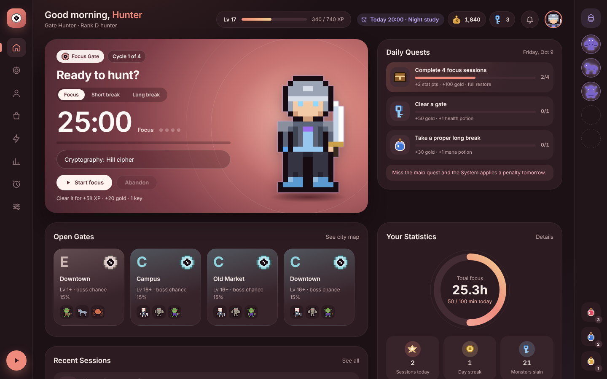
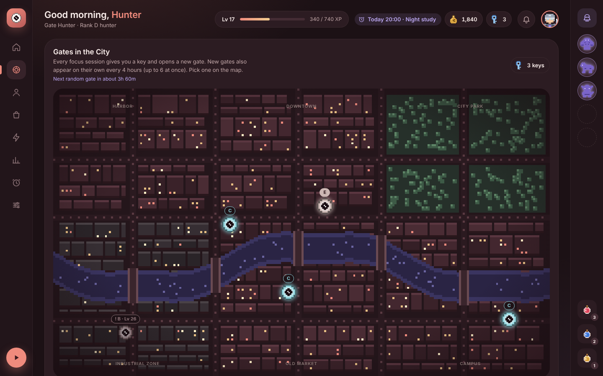
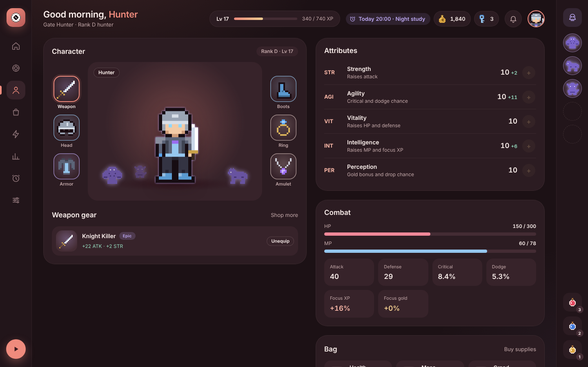
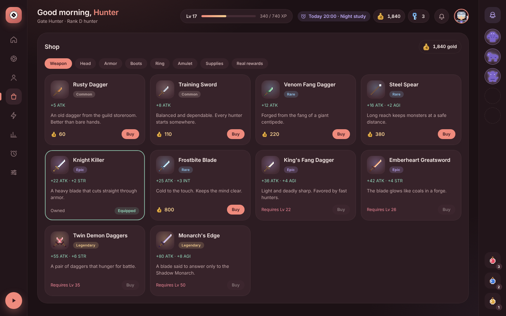
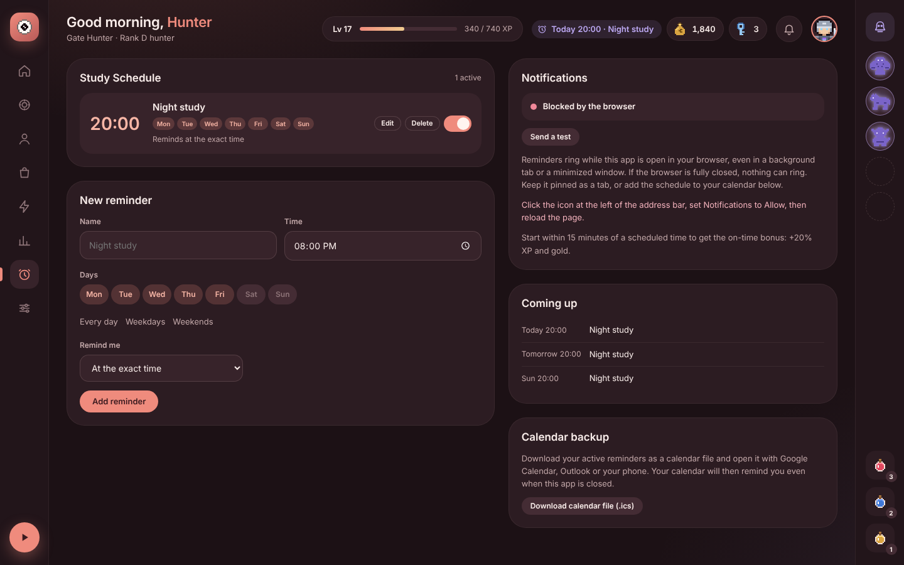
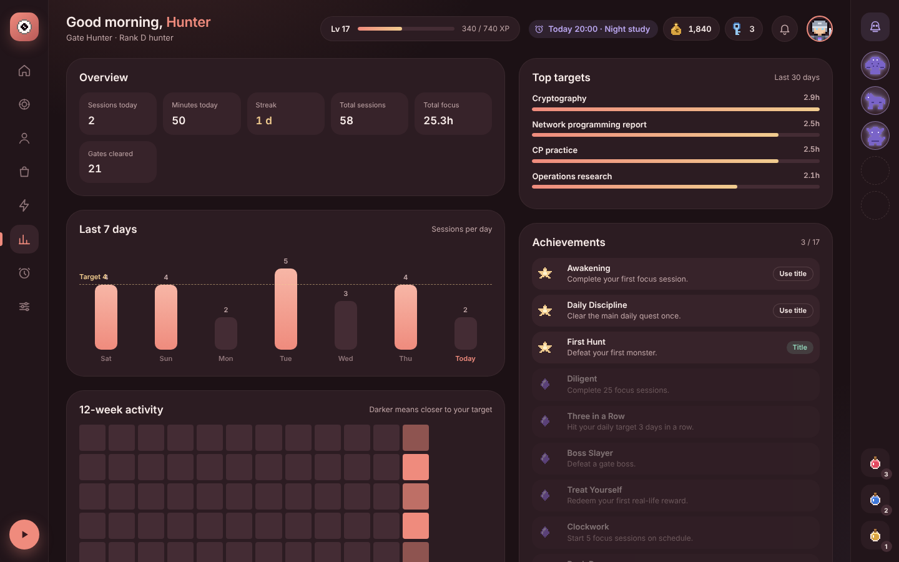

<div align="center">


# Hunter System

**A gamified Pomodoro tracker inspired by *Solo Leveling*.**
Every focus session is a quest. Clear it to level up, earn gold, gear up your hunter and fight monsters in gates around the city.


</div>



## About

Hunter System is a personal study tracker that turns the Pomodoro technique into an RPG. It runs as **one HTML file** in the browser: no install, no account, no server. Your progress is saved in the browser automatically.

The idea comes from the "System" in *Solo Leveling*: daily quests, penalties for slacking, levels, stats, gear, shadow soldiers and dungeon gates.

## Features

### Focus and progress
- **Pomodoro timer** with focus, short break and long break (durations are adjustable)
- **Rewards scale with focus time**: 2 XP and 0.8 gold per minute, plus bonuses
- **Pick 1 of 3 bonus rewards** after every session (gold, potions, gate keys, stat crystals, gear chests…)
- **Daily quests**: 1 main quest (hit your session target) and 2 rotating side quests
- **Penalty system**: abandoning a session or missing the main daily quest has a cost
- **Journal**: 7-day chart, 12-week activity heatmap, top study targets, session log, streaks
- **16 achievements** that unlock titles

### RPG
- **Levels and ranks** from E to S, with 3 stat points per level
- **5 attributes**: STR, AGI, VIT, INT (boosts focus XP) and PER (boosts gold)
- **41 pieces of equipment** across 6 slots (weapon, head, armor, boots, ring, amulet) and 4 rarities
- **Pixel-art hunter** whose look changes with the gear you wear
- **9 skills** unlocked by level, including Shadow Extraction
- **Shadow army**: defeated monsters can rise and fight for you

### Gates and battles
- **City map** with gates spread across 6 districts, each with a rank
- A new gate opens after every focus session and **every 4 hours on its own** (max 6)
- **Red gates**: guaranteed boss, double loot, no escape
- **Turn-based text battles** against 30 pixel-art monsters

### Motivation tools
- **Real rewards shop**: spend gold on real-life treats you price yourself (e.g. "30 minutes of gaming")
- **Study reminders**: schedule study times per day of the week with an alarm, notification and snooze
- **On-time bonus**: start within 15 minutes of a scheduled time for +20% XP and gold
- **Calendar export (.ics)** so your phone or calendar reminds you even when the app is closed
- **Notification inbox** for everything the System tells you

## Screenshots

| Gates | Character |
|---|---|
|  |  |

| Shop | Schedule |
|---|---|
|  |  |



## Getting started

### Run it locally
1. Download or clone this repository.
2. Open `sistem-pemburu.html` in **Google Chrome** or **Microsoft Edge**.
3. Enter your hunter name and press **Accept**.

That's it. No build step and no dependencies. Fonts load from Google Fonts when you are online and fall back to system fonts offline.

### Pin it to the Windows taskbar
Create a desktop shortcut with this target (adjust the path to where the file is):

```
"C:\Program Files\Google\Chrome\Application\chrome.exe" --app="file:///C:/path/to/sistem-pemburu.html"
```

Then right-click the shortcut → **Properties** → **Change Icon** → pick `hunter-system.ico`, and finally right-click → **Pin to taskbar**. The app opens in its own window without an address bar.

### Use it online with GitHub Pages
1. Go to **Settings → Pages** in this repository.
2. Under **Source**, choose **Deploy from a branch**, select `main` and `/ (root)`, then **Save**.
3. Open `https://<your-username>.github.io/<repo-name>/sistem-pemburu.html`.

Hosting on https also lets desktop notifications work reliably. Progress saved on GitHub Pages is separate from progress saved in the local file, so use **Export** and **Import** to move it.

## How progress is saved

- Everything is stored in the browser's `localStorage`, automatically, after every action.
- Progress stays as long as you use **the same browser** and **the same file location**.
- It can be lost if you clear site data, use incognito mode, switch browsers or move the file.
- **Back up regularly**: Settings → **Export data** saves a `.json` file. **Import data** restores it.

## Reward reference

| Action | Reward |
|---|---|
| Complete a focus session | 2 XP + 0.8 gold per minute, 1 gate key, 1 new gate, 1 bonus pick |
| Main daily quest | +2 stat points, +100 gold, full HP & MP |
| Start on schedule | +20% XP and gold for that session |
| Abandon a session (after 1 min) | −10% HP, −10 gold, logged as failed |
| Miss the main daily quest | Lose up to 30% gold, "Weakened" for 2 battles, streak reset |

## Tech

- Plain HTML, CSS and JavaScript in a single file
- Pixel art drawn at runtime on `<canvas>` from small character maps
- `localStorage` for saves, Notification API for alerts, Web Audio for sounds
- Fonts: Sora and Plus Jakarta Sans

## Project structure

```
├── sistem-pemburu.html   # the whole app
├── hunter-system.ico     # taskbar / shortcut icon
├── screenshots/          # images for this README
└── README.md
```

## Credits

Inspired by *Solo Leveling* (Chugong). This is a fan-made personal productivity project and is not affiliated with the original work.
